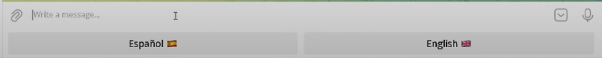
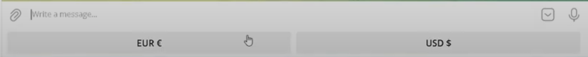
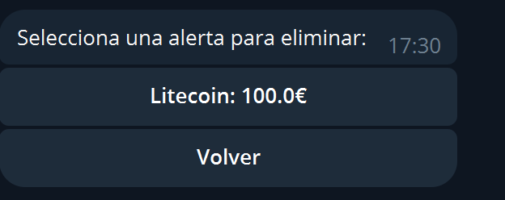

# CoinChat

Este bot de Telegram permite a los usuarios consultar el precio actual de varias criptomonedas y establecer alarmas que envían notificaciones cuando el precio de una criptomoneda alcanza un nivel específico.

## Funciones Principales

1. **Consulta de Precios de Criptomonedas**
   - Los usuarios pueden consultar el precio actual de diferentes criptomonedas.
   - Soporte para criptomonedas populares como Bitcoin (BTC), Ethereum (ETH) y Litecoin (LTC).

2. **Alarmas de Precios**
   - Los usuarios pueden establecer alarmas para recibir notificaciones cuando una criptomoneda alcanza un precio objetivo.
   - Alarmas personalizables para diferentes criptomonedas.

## Requisitos

- Python 3.6 o superior
- Librerías:
  - `python-telegram-bot`
  - `requests`
  - `sqlite3`

## Instalación

1. Clona este repositorio:
   ```bash
   git clone https://github.com/tu_usuario/crypto-alarm-bot.git
   cd crypto-alarm-bot
   ```
2. Instala las dependencias:
    ```bash
   pip install -r req.txt
    ```
3. Configura el archivo ```config.py``` con tu token de bot de Telegram y otros prámetros necesarios.

## Uso

1. Inicia el bot con ```python app.py``` y luego el ```python ManageLoop.py```.

2. Ejecutamos ```/start```

3. Seleccionamos el idioma.


4. Y ahora la moneda.


## Precio

1. Pulsamos sobre el boton de precio.


2. Seleccionamos la moneda deseada.


## Alertas
### Configurar alertas


1. Seleccionamos la criptomoneda deseada.

2. Introducimos la cantidad deseada 
### Mis alertas


- En caso de no tener alertas saldra este mensaje.


- Si por otro caso si tenemos alertas configuradas saldra este mensaje. Pulsando sobre la alarma la eliminara.


